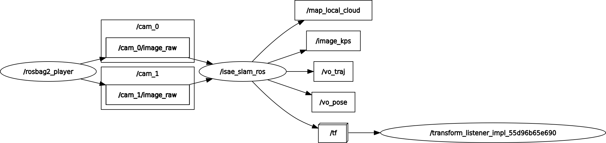

# SaDVIO

This library provide a modular C++ framework dedicated on research about Visual Odometry (VO) and Visual Inertial Odometry (VIO). It also contains implementations of research works done at ISAE such as: factor graph sparsification, traversability estimation with 3D mesh and non overlapping field of view VO. This version is compatible with the middleware ROS2. 

<p align='center'>
    
</p>


# Installation

Here are the dependencies:
* [OpenCV](https://github.com/opencv/opencv/tree/4.10.0) for image processing
* [CERES](http://ceres-solver.org/installation.html) a non linear solver from google
* [Eigen](https://eigen.tuxfamily.org/dox/GettingStarted.html) a linera algebra library
* [yaml-cpp](https://github.com/jbeder/yaml-cpp) to parse config files 

You can either run this code with [ROS2](http://docs.ros.org/en/humble/Installation.html), the famous robotic middleware, or without ROS2. For now it has been tested with Galactic and Humble. A few changes are needed for Jazzy but only in the ros folder.

## ROS2 install 

Once these are all installed, use the following commands to build:

```
cd ~/your_ws/src
git clone https://github.com/ISAE-PNX/SaDVIO.git
cd ..
colcon build --symlink-install --packages-select isae_slam_ros
```
Then launch the program with:
```
ros2 launch isae_slam_ros isae_slam.xml
```
You can then play a rosbag with the topics specified in the [config](ros/config) files. Remember to `colcon build` the package if adding new config files for your dataset.

## Classic install

Go in the `cpp` folder and build it 

```bash
cd ~/your_ws/src
git clone https://github.com/ISAE-PNX/SaDVIO.git
cd SaDVIO/cpp
mkdir build
cd build
cmake ..
make
```
You can then run this executable, adding the folder of the config files and the folder of your dataset:
```bash
./isaeslam "/ur/path/SaDVIO/ros/config" "/ur/path/V1_01_easy/mav0"
``` 
 Your dataset must be at the [EUROC dataset](https://projects.asl.ethz.ch/datasets/doku.php?id=kmavvisualinertialdatasets) format and you must edit properly the files in the [config folder](ros/config).

To make SaDVIO available as a library, install it
```bash
# depending on the install path ${CMAKE_INSTALL_LIBDIR}, sudo may not be required - but make sure that CMake can find it!
sudo make install
```
The default location of the installed library is `/usr/local/lib` (so `sudo` required). 
```bash
# the compiled library
/usr/local/lib/isae_slam/libisae_slam.so
# config file for cmake
/usr/local/lib/cmake/isae_slam/isae_slamConfig.cmake
```

## Docker install

We have included a docker installation of SaDVIO in the [docker](docker) folder. Simply run the run.sh script to build and run the image. A sequence of the EUROC dataset is downloaded for a first try. To run it, do the following:
```
cd SaDVIO/cpp/build/
./isaeslam "/root/SaDVIO/ros/config" "/root/V1_01_easy/mav0/"
```

# Usage

The ROS2 visualizer (`rosVisualizer.h`) is not only responsible for the visualization but for all ROS2 outputs from SaDVIO.
The SLAM results are checked once every millisecond and, if there is new information to display, it is published through the following topics.
The SLAM's displayable values are reset after publishing so that the visualizer only publishes new information (the SLAM maintains its internal values).

## Topics

<p align='center'>
    
</p>

### `vo_pose`

Of type `geometry_msgs::msg::PoseStamped`; provides the current estimated pose (rotation + translation in a fixed local frame) from the SLAM's `_frame_to_display`.

### `image_kps`

Of type `sensor_msgs::msg::Image`; displays the latest key frame image with the detected features: Red for tracked features, Blue for untracked features, Green for 'resurrected' features. Based on the SLAM's `_frame_to_display`


### `vo_traj`

Of type `visualization_msgs::msg::Marker`; displays the current estimated trajectory of the vehicle (positions only, given in the local world frame). Based on the SLAM's `_local_map_to_display`.

### `map_local_cloud`

Of type `visualization_msgs::msg::Marker`; displays the sparse point cloud of features detected in the latest key frame. Based on the SLAM's `_local_map_to_display`.

### `mesh`

Of type `visualization_msgs::msg::Marker`; displays the current densified terrain mesh as a set of polygons, colored by slope. Based on the SLAM's `_mesh_to_display`.

### `point_cloud`

Of type `sensor_msgs::msg::PointCloud2`; displays the current densified point cloud extracted from the mesh. Based on the SLAM's `_mesh_to_display`.

# Disclaimer

A few functionnalities are currently being tested, their performances are not guaranteed and were not presented in any paper:
* The lines as features and landmarks
* The *mono* and *monovio* modes work decently 

Please consider citing one of the related work if you use our system in your research:

```
@inproceedings{sparsifDebeunne,
  author={Debeunne, César and Vallvé, Joan and Torres, Alex and Vivet, Damien},
  booktitle={2023 IEEE/RSJ International Conference on Intelligent Robots and Systems }, 
  title={Fast Bi-Monocular Visual Odometry Using Factor Graph Sparsification}, 
  year={2023},
  pages={10716-10722},
}
```

```
@inproceedings{debeunne2023non,
  title={Non-Recovering Field-of-View Imaging-Based SLAM for Lava Tubes Exploration},
  author={Debeunne, C{\'e}sar and Vivet, Damien and Torres, Alex},
  booktitle={17th Symposium on Advanced Space Technologies in Robotics and Automation (ASTRA)},
  year={2023}
}
```

```
@article{debeunne2024sadvio,
  title={SaDVIO: Sparsify and Densify VIO for UGV Traversability Estimation},
  author={Debeunne, C{\'e}sar and Torres, Alex and Vivet, Damien},
  journal={IEEE Robotics and Automation Letters},
  year={2024}
}
```